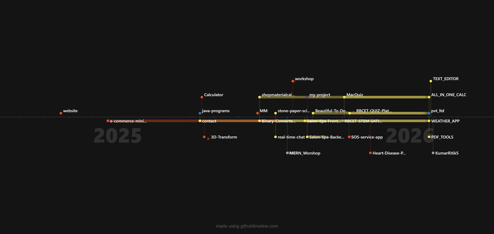

# 💫 About Me:
Hi, I’m Ritik Kumar 👨‍💻 A Computer Science (B.Tech) student passionate about Software Development and Web Technologies.  I enjoy building modern web applications using React, Tailwind CSS, JavaScript, and Java, and I love learning by building real-world projects.  🚀 Aspiring Software Engineer | Always learning, always building.

## 🌐 Socials:
     

# 💻 Tech Stack:
            

# 📊 GitHub Stats:
 
 

---

<!-- Proudly created with GPRM ( https://gprm.itsvg.in ) -->
